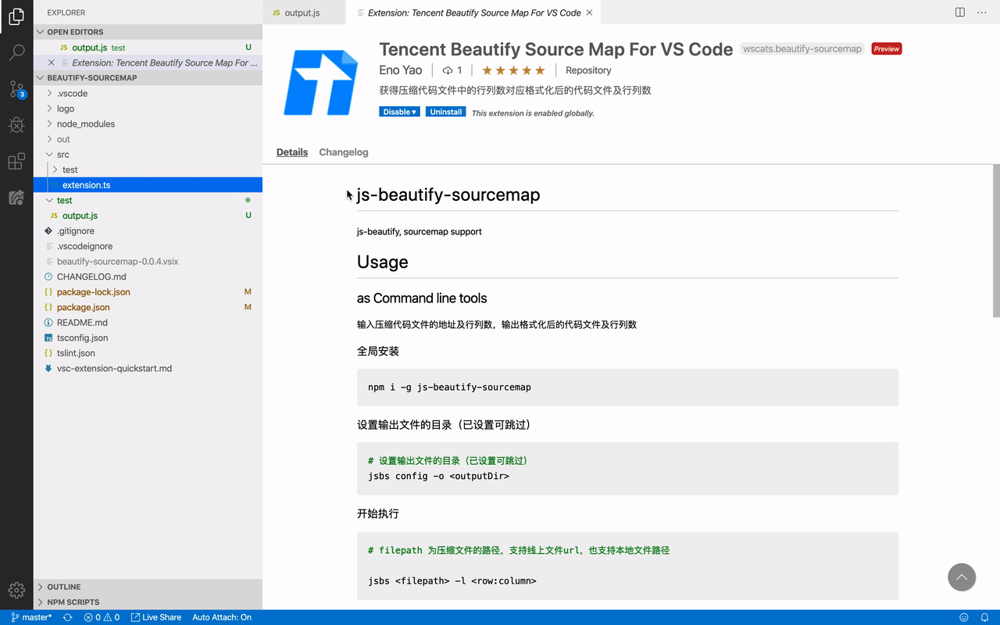

# Tencent Beautify Sourcemap

<a href="https://marketplace.visualstudio.com/items?itemName=Wscats.beautify-sourcemap"></a>
<a href="https://marketplace.visualstudio.com/items?itemName=Wscats.beautify-sourcemap"></a>
<a href="https://github.com/Wscats/compile-hero"></a>
<a href="https://github.com/Wscats"></a>
<a href="https://github.com/Wscats"></a>

Tencent Beautify Source Map For VS Code 是腾讯文档产品的 Visual Studio Code 插件。该插件可以让您更好地在本地进行项目开发和代码调试。

通过该插件，您可以：

- 拉取远程 SourceMap 代码到本地，并格式化和定位行列数。
- 在本地开发、调试及测试您的文档代码。

# Usage

在任一文件中，新建一份 `xxx.js`，并对该文件点击右键，会出现 `Beautify Source Map` 选项，工作区上面会出现一个输入框，并提醒您输入远程 JS 压缩代码地址及行列数，如下：
<!-- https://docs.idqqimg.com/tim/docs/sheets/static/js/bundle_report_lazy-86eab7ee1b.js:1:66 -->
```sh
# 远程压缩代码地址:行数:列数
https://github.githubassets.com/assets/frameworks-fd548924.js:1:66
```

输入完成后按回车键，会在该 `xxx.js` 输出格式化后的代码文件及行列数。



# Thanks

如果您有任何疑问，您可以在 [Issues](https://github.com/enoyao/beautify-sourcemap/issues/new) 里面给我们留言，你的支持是我们前进的最大动力😁

# License

Tencent Beautify Source Map For VS Code 基于 [MIT](https://opensource.org/licenses/MIT) 协议。